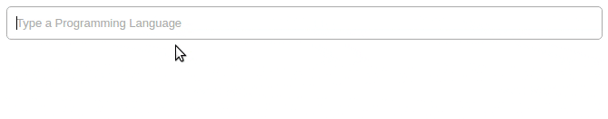

# React Chips [](https://www.npmjs.org/package/react-chips) [](https://circleci.com/gh/gregchamberlain/react-chips)

A controlled React input for arrays of data.


**Chip**

A chip is a component used to represent an arbitrary data object.


## Getting Started

```
npm install --save react-chips
```

```js
import React, { Component } from 'react';
import Chips, { Chip } from '../src'

class YourComponent extends Component {

  constructor(props) {
    super(props);
    this.state = {
      chips: []
    }
  }

  onChange = chips => {
    this.setState({ chips });
  }

  render() {
    return (
      <div>
        <Chips
          value={this.state.chips}
          onChange={this.onChange}
          suggestions={["Your", "Data", "Here"]}

        />
      </div>
    );
  }
}
```

## Chips

|Property|Type|Required|Description|
|--------|----|:-----:|-----------|
|`value`|Array|✓|An array of data that represents the value of the chips|
|`onChange`|Function|✓|A function called when the value of chips changes, passes the chips value as an argument.|
|`placeholder`|String||The placeholder to populate the input with|
|`theme`|Object||A [react-themeable](https://github.com/markdalgleish/react-themeable) theme|
|`suggestions`|Array||Data to fill the autocomplete list with|
|`fetchSuggestions`|Function|| Delegate expecting to recive autocomplete suggestions (callback or promise)|
|`fetchSuggestionsThrushold`|Number|| Maximum calls to fetchSuggestions per-second |
|`fromSuggestionsOnly`|Boolean||Only allow chips to be added from the suggestions list|
|`uniqueChips`|Boolean||Only allow one chip for each object|
|`renderChip`|Function||For custom chip usage. A function that passes the value of the chip as an argument, must return an element that will be rendered as each chip.|
|`suggestionsFilter`|Function||A function that is passed an autoCompleteData item, and the current input value as arguments. Must return a boolean for if the item should be shown.|
|`getChipValue`|Function||A function used to change the value that is passed into each chip.|
|`createChipKeys`|Array||An array of keys/keyCodes that will create a chip with the current input value when pressed. (Will not work of `fromSuggestionsOnly` is true).|
|`getSuggestionValue`|Function||The value to show in the input when a suggestion is selected|
|`renderSuggestion`|Function||For custom autocomplete list item usage. A function that passes the value as an argument, must return an element to render for each list item.|
|`shouldRenderSuggestions`|Function||See [AutoSuggest](https://github.com/moroshko/react-autosuggest#shouldRenderSuggestionsProp)|
|`alwaysRenderSuggestions`|Boolean||See [AutoSuggest](https://github.com/moroshko/react-autosuggest#alwaysRenderSuggestionsProp)|
|`highlightFirstSuggestion`|Boolean||See [AutoSuggest](https://github.com/moroshko/react-autosuggest#focusFirstSuggestionProp)|
|`focusInputOnSuggestionClick`|Boolean||See [AutoSuggest](https://github.com/moroshko/react-autosuggest#focusInputOnSuggestionClickProp)|
|`multiSection`|Boolean||See [AutoSuggest](https://github.com/moroshko/react-autosuggest#multiSectionProp)|
|`renderSectionTitle`|Function|✓ when multiSection={true}|See [AutoSuggest](https://github.com/moroshko/react-autosuggest#renderSectionTitleProp)|
|`getSectionSuggestions`|Function|✓ when multiSection={true}|See [AutoSuggest](https://github.com/moroshko/react-autosuggest#getSectionSuggestionsProp)|

## Styles

This project uses [react-themeable](https://github.com/markdalgleish/react-themeable) and  [Radium](http://stack.formidable.com/radium/) for styling. The `Chips`, and default `Chip` components both accept a theme prop. The theme structure, and default theme can be found [here](src/theme.js)

## Custom Chip Component
You may use a custom chip component, simply return the custom component to the renderChip prop function. This component will receive the following additional props from the Chips component.

```js
<Chips
  ...
  renderChip={value => <CustomChip>{value}</CustomChip>}
/>
```

|Property|Type|Description|
|--------|----|-----------|
|selected|bool|A boolean that tells the chip if it is currently selected.|
|onRemove|func|A function to be invoked when the chip should be removed|

## Async Suggestions
To fetch asynchronous suggestions use `fetchSuggestions`.

```js
<Chips
  ...
  fetchSuggestions={(value, callback) => {
    someAsynCall(callback)
  }}
/>

// or with a Promise

<Chips
  ...
  fetchSuggestions={(value) => someAsyncCallThatReturnsPromise}
/>
```